## Application desktop de gestion de parapharmacie

1. Interface de login

2. Dashboard
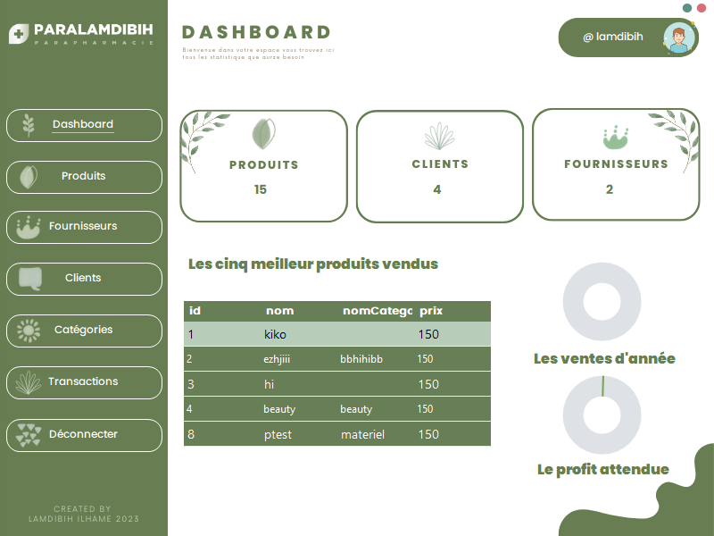

3. Gestion produits
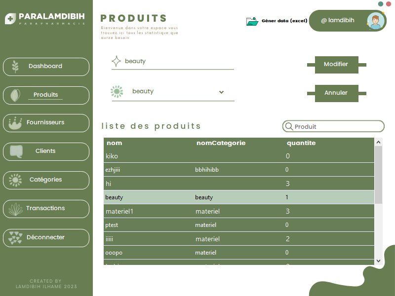

4. Gestion fournisseurs
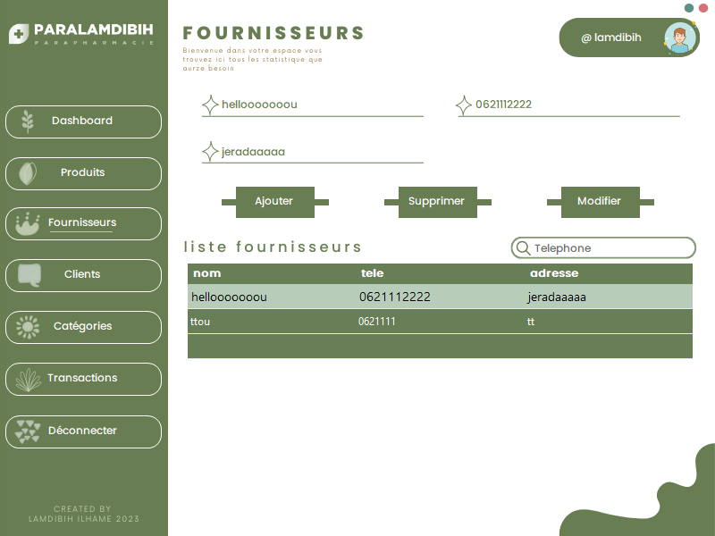

5. Gestion clients
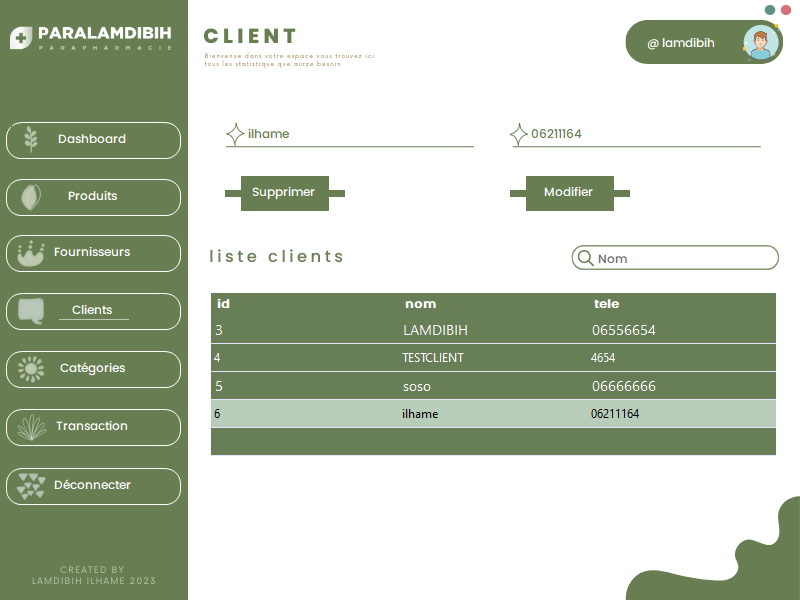

6. Gestion catégories
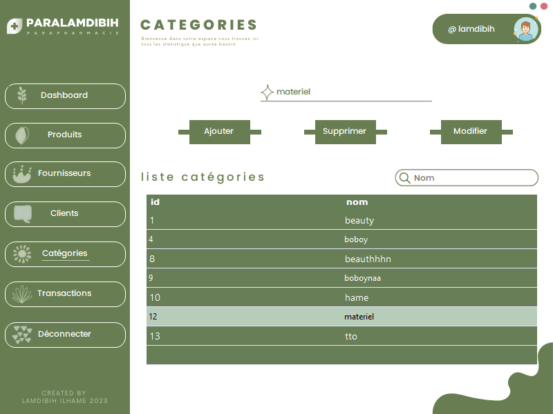

6. Gestion des transactions
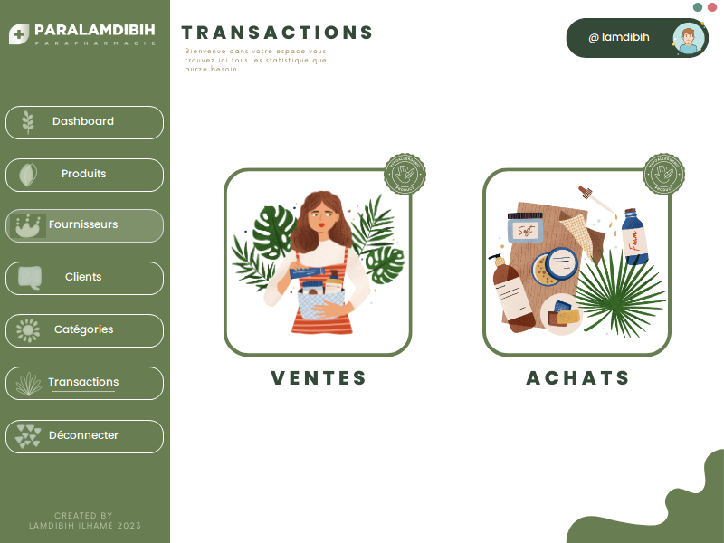

7. Gestion les transactions des clients
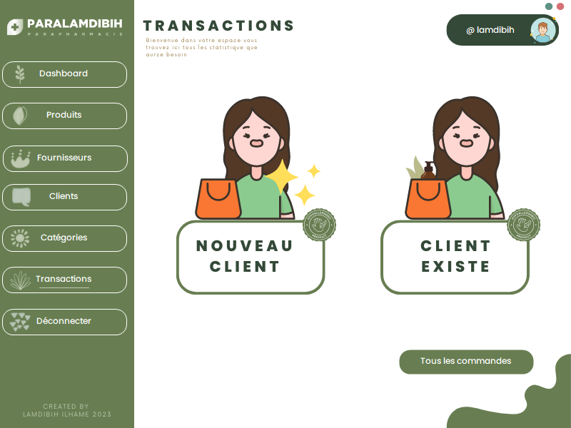

### Nouveau client
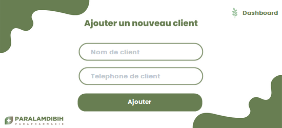

### liste des clients
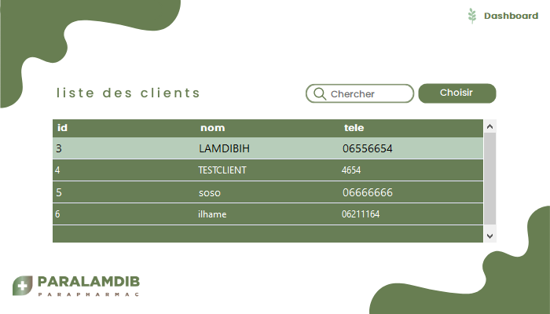

8. Gestion des achats
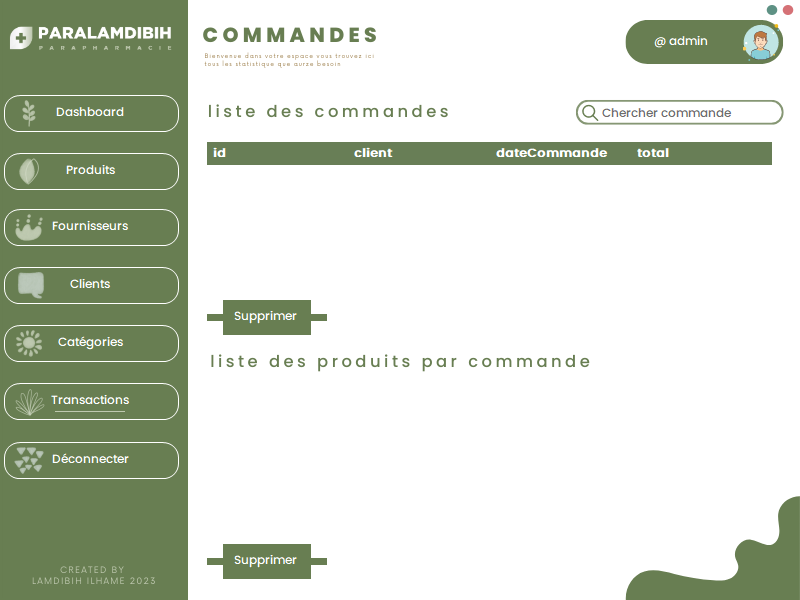

9. Gestion des achats
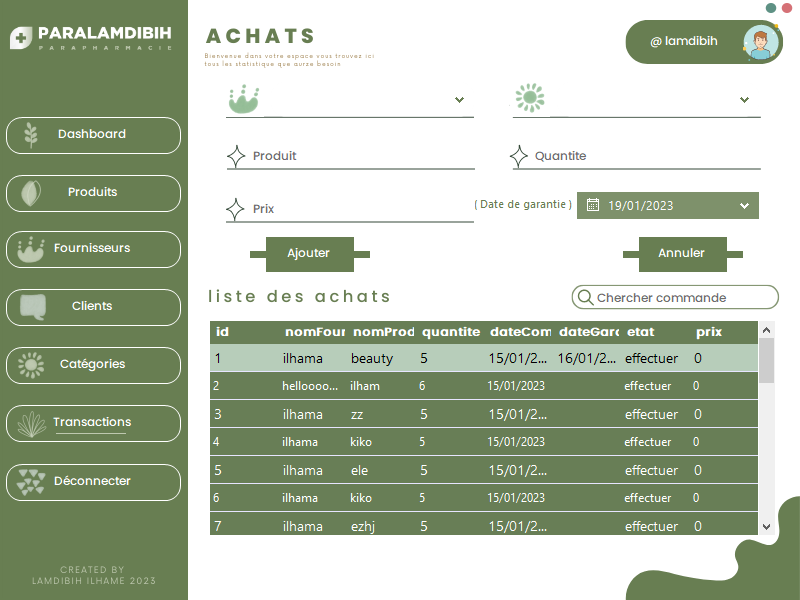

10. Générer les fichiers
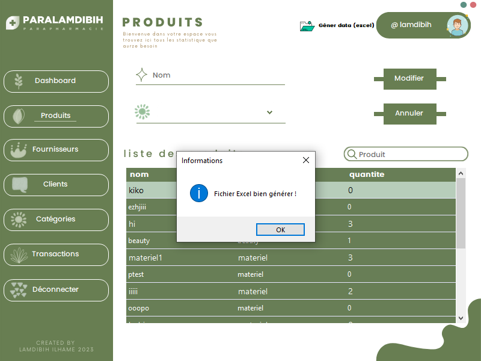

### Fichier Excel

